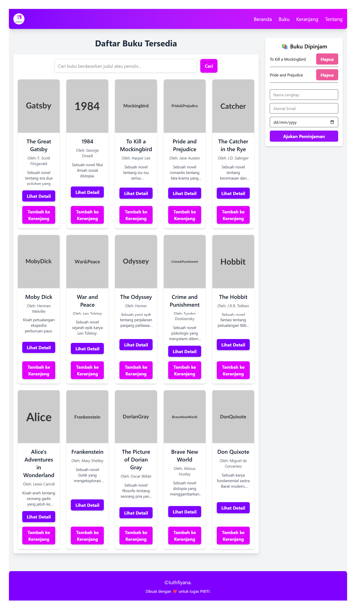

# Bookclub React Project

Sebuah aplikasi web "Bookclub" yang dikembangkan sebagai bagian dari pelatihan ReactJS PIBITI. Proyek ini dibangun untuk mendemonstrasikan penerapan materi dari Day 1 hingga Day 4, mencakup dasar-dasar React, hooks, routing, styling dengan Tailwind CSS, dan integrasi API.

---

## Fitur Proyek

### Day 1: React Vite & Components

- **Setup Proyek:** Menggunakan Vite untuk inisialisasi proyek React yang cepat.
- **Struktur Komponen:** Membangun antarmuka pengguna dengan komponen React modular dan dapat digunakan kembali:
  - `App.jsx`: Komponen utama yang mengelola layout dan menampilkan komponen lainnya.
  - `Header.jsx`: Bagian atas halaman dengan logo dan navigasi.
  - `Footer.jsx`: Bagian bawah halaman.
  - `BookList.jsx`: Menampilkan daftar buku.
  - `BookCard.jsx`: Menampilkan detail setiap buku dalam bentuk kartu.
  - `BookDetailPage.jsx`: Menampilkan detail lengkap satu buku (saat ini di-_hardcode_).
  - `Cart.jsx`: Menampilkan item di keranjang peminjaman.
  - `CartItem.jsx`: Menampilkan detail setiap item di keranjang.
  - `CheckoutForm.jsx`: Formulir untuk proses peminjaman.
  - `SearchBar.jsx`: Input untuk pencarian buku.
- **Data Dummy:** Penggunaan data buku dan keranjang dummy untuk demonstrasi awal.

---

### Day 2: React Hooks - State dan Side Effects

Berikut adalah pratinjau antarmuka setelah implementasi hooks di Day 2:


1.  **useState:** Digunakan untuk:
    - Mengelola state lokal seperti: Data form (nama, email, tanggal).
    - Daftar buku di keranjang.
    - Menyediakan interaksi pada UI.
2.  **useEffect:** Digunakan untuk:
    - Menyimpan isi keranjang ke localStorage.
    - Memuat data keranjang dari localStorage saat halaman direfresh.
    - Mengubah judul halaman dinamis sesuai jumlah buku di keranjang.

**Contoh Implementasi:**

- Komponen `App.jsx`: menerapkan `useEffect` untuk sinkronisasi `cartItems`.
- Komponen `CartAndForm.jsx`: menggunakan `useState` untuk form input pengguna.

---

### Day 3: React Router & Tailwind CSS

Pada tahap ini, aplikasi difokuskan pada implementasi navigasi antar halaman, _styling_ menggunakan Tailwind CSS, dan penataan ulang kode untuk struktur yang lebih bersih.

**Detail Implementasi:**

1.  **React Router (Routing antar Halaman):**
    - `main.jsx`: Menggunakan `BrowserRouter` sebagai penyedia routing utama.
    - `App.jsx`: Bertindak sebagai _router_ utama yang mendefinisikan tiga rute inti aplikasi:
      - `/`: **Beranda**, menampilkan daftar buku dan formulir peminjaman di tata letak grid. Judul "Daftar Buku Tersedia" dipusatkan.
      - `/book/:id`: **Halaman Detail Buku**, menampilkan informasi lengkap buku yang dipilih.
      - `/receipt`: **Halaman Struk Peminjaman**, menampilkan detail transaksi peminjaman.
    - **Navigasi Non-Header:** Navigasi antar halaman terutama dilakukan melalui interaksi pengguna (misalnya, tombol "Lihat Detail" pada kartu buku, tombol "Ajukan Peminjaman" pada formulir, dan tombol "Kembali" di halaman detail/struk). Logo "BookClub" di _header_ juga berfungsi sebagai _link_ ke beranda.
2.  **Tailwind CSS (Styling):**
    - Implementasi ekstensif Tailwind CSS di seluruh komponen untuk mencapai desain yang responsif dan konsisten. Ini mencakup penggunaan kelas utilitas untuk tata letak, tipografi, warna, bayangan, dan efek transisi.
3.  **Struktur Proyek yang Lebih Rapi:**
    - **`src/hooks/`**: Folder baru dibuat untuk menampung _custom hook_ (`useBook.jsx`). _Hook_ ini mengkonsolidasikan semua logika _state_ utama (keranjang, pencarian, buku terpilih, struk peminjaman) dan fungsi-fungsi terkait, membuat `App.jsx` menjadi lebih ringkas dan berfokus pada _rendering_.
    - **`src/pages/`**: Folder baru untuk komponen halaman utama (`BookDetailPage.jsx`, `ReceiptPage.jsx`) yang diakses secara langsung melalui _routing_.
    - **`src/components/`**: Digunakan untuk komponen UI yang lebih kecil dan dapat digunakan kembali di berbagai halaman.

---

### Day 4: React API & Axios

Pada tahap terakhir ini, aplikasi diintegrasikan dengan _fake API_ lokal menggunakan JSON Server dan Axios, serta menambahkan sistem notifikasi untuk _feedback_ pengguna yang lebih baik.

**Detail Implementasi:**

1.  **Integrasi API dengan JSON Server dan Axios:**
    - **JSON Server:** Digunakan sebagai _mock backend_ lokal yang melayani data buku dari `data.json` di `http://localhost:5000`. Ini memungkinkan pengembangan _frontend_ tanpa ketergantungan pada _backend_ sungguhan.
    - **Axios Instance (`src/api/index.js`):** Objek Axios kustom dibuat dengan `baseURL` yang mengarah ke JSON Server, memusatkan konfigurasi API.
    - **`src/hooks/useBook.jsx`:**
      - Fungsi `fetchBooks` menggunakan `axios.get('/books?q=${searchQuery}')` untuk mengambil daftar buku. JSON Server secara otomatis memfilter berdasarkan _query_ `q`.
      - Menangani _loading state_ (`loading`) untuk menampilkan indikator pemuatan dan _error state_ (`error`) jika ada masalah dengan permintaan API.
    - **`src/pages/BookDetailPage.jsx`:**
      - Menggunakan `useParams` untuk mendapatkan `id` buku dari URL.
      - Melakukan permintaan `axios.get('/books/${id}')` secara independen untuk mengambil detail buku spesifik, membuatnya _robust_ terhadap _refresh_ halaman langsung.
      - Menampilkan _loading_ atau _error state_ di halaman detail.
2.  **Sistem Notifikasi Kustom:**
    - **`src/components/Notification.jsx`:** Sebuah komponen UI sederhana dibuat untuk menampilkan pesan notifikasi (_toast notification_). Notifikasi ini:
      - Memiliki tipe (`success`, `warning`, `error`) yang menentukan warnanya.
      - Muncul secara _fixed_ di pojok kanan atas layar (`top-4 right-4`).
      - Secara otomatis menghilang setelah 3 detik atau dapat ditutup manual.
    - **`src/hooks/useBook.jsx`:**
      - Mengelola _state_ notifikasi (`notification`).
      - Fungsi `showNotification` terpusat untuk memicu notifikasi dari berbagai _handler_ (misalnya, `handleAddToCart`, `handleSubmitBorrow`).
    - **Penggunaan Notifikasi:**
      - Memberi tahu pengguna ketika buku berhasil ditambahkan ke keranjang, atau jika buku sudah ada di keranjang.
      - Memberikan _feedback_ yang lebih baik ketika keranjang kosong saat mencoba mengajukan peminjaman.
      - Menampilkan pesan _error_ jika gagal mengambil data dari API.
3.  **Refactoring Lanjutan:**
    - `App.jsx` menjadi lebih ramping karena data `dummyBooks` dihapus dan diganti dengan data dari API melalui `useBook` _hook_.
    - `BookList.jsx` dan `BookDetailPage.jsx` sekarang menampilkan status _loading_ dan _error_ yang diterima melalui _props_.
    - `BookList` diatur agar bisa di-_scroll_ secara independen (`overflow-y-auto`, `max-height`), meningkatkan _user experience_ pada halaman beranda.

---

## Preview Aplikasi

Berikut adalah pratinjau tampilan utama aplikasi BookClub:

**Halaman Beranda:**


**Halaman Detail Buku:**


**Halaman Struk Peminjaman:**


**Notifikasi (contoh):**


---

## Struktur Repository (Branching Strategy)

Repository ini diatur dengan strategi _branching_ yang mencerminkan progres harian bootcamp:

- `main`: _Branch_ utama yang akan selalu berisi versi proyek yang paling stabil dan terkini (hasil gabungan dari semua hari).
- `day-1`: Berisi implementasi materi Day 1 (React Vite dan Components).
- `day-2`: Berisi implementasi materi Day 2 (React Hooks).
- `day-3`: Berisi implementasi materi Day 3 (React Router dan Tailwind CSS).
- `day-4`: Berisi implementasi materi Day 4 (React API dan Axios).

Setiap _branch_ harian akan di-_merge_ ke `main` setelah pekerjaan hari tersebut selesai.

---

## Teknologi yang Digunakan

- **ReactJS**
- **Vite**
- **Tailwind CSS**
- **React Router Dom**
- **Axios** (untuk _HTTP requests_)
- **JSON Server** (untuk _mock API_ lokal)
- **JavaScript**

---

## Cara Menjalankan Proyek (Lokal)

Pastikan Anda memiliki [Node.js](https://nodejs.org/) dan [npm](https://www.npmjs.com/) terinstal di sistem Anda.

1.  **Clone repositori:**

    ```bash
    git clone https://github.com/Luthfiyana/PIBITI-bookclub.git
    cd PIBITI-bookclub
    ```

2.  **Install dependensi:**

    ```bash
    npm install
    ```

3.  **Siapkan dan Jalankan JSON Server (di terminal terpisah):**
    Ini akan membuat _fake API_ lokal yang akan digunakan aplikasi Anda. Pastikan _file_ `data.json` ada di _root_ proyek.

    ```bash
    npx json-server --watch data.json --port 5000
    ```

4.  **Jalankan aplikasi di development mode (di terminal lain):**

    ```bash
    npm run dev
    ```

5.  Buka browser Anda dan kunjungi `http://localhost:5173` (atau port lain yang ditunjukkan oleh Vite).

---

## Kontributor

- luthfiyana
